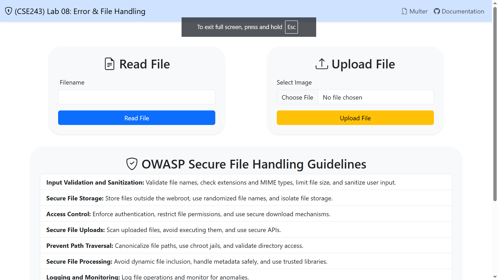

  
## 1. Learning Objectives

By the end of this session students will be able to:

1. Identify common file‑handling and error‑handling vulnerabilities in a Node.js/Express web app.
2. Explain the risks associated with poor input validation and weak error handling.
3. Apply secure coding patterns to mitigate path traversal and unhandled exceptions.
4. Refactor existing code to enforce input sanitization, proper error handling, and safe defaults.
5. Demonstrate the secure version of the web app and verify its behavior.

---

## 2. Prerequisites & Materials

- **Prerequisites:**
  - Basic JavaScript/Node.js and Express knowledge.
  - Git, Node.js v14+ installed.
  - Code editor (VS Code recommended).

- **Materials:**
  - Cloned project folder containing the vulnerable Express app.
  - Handout with code snippets and lab instructions (this document).

---

## 3. Detailed Lab Tasks

1. **Secure Read Endpoint**
   - Wrap `fs.readFile` in `try/catch` or handle callback errors.
   - Validate `req.query.filename` against a whitelist directory.

```JS
const allowedDirectory = path.join(__dirname, 'files'); // Define a whitelist directory
const filename = req.query.filename;  // Get filename from query parameter
const filePath = path.join(allowedDirectory, filename);

// Validate that the resolved path is within the allowed directory
if (!filePath.startsWith(allowedDirectory)){
    res.status(400).send('Invalid file path.');
    return;
}

try {
    const data = fs.readFileSync(filename, 'utf8');
    res.send(data);
} catch (err) {
    res.status(500).send('File Not Found! ' + '<a href="/">Try again</a>');
    fs.appendFileSync('error.log', `Error reading file: ${err.message}\n`);
} finally {
    console.log(`Attempted to read file: ${filename}`);
}

```

2. **Secure Upload Endpoint**


---

## 3. Further Reading & Resources

- OWASP File Handling Cheat Sheet: https://cheatsheetseries.owasp.org/cheatsheets/File_Handling_Cheat_Sheet.html
- Node.js Security Best Practices: https://nodejs.org/en/docs/guides/security/
- Express Error Handling: https://expressjs.com/en/guide/error-handling.html


